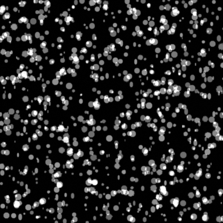

# Synthetic Image Generator
Synthetic Image Generator is a Python tool for creating synthetic fluorescence microscopy images of yeast cells, along with their labeled counterparts. This generator is ideal for creating datasets for training machine learning models in cell segmentation tasks, particularly in neuroscience and biological research.

<p align="center">
  
  <br>
  <em>Example of a Generated Fluorescence Image (1024 x 1024)</em>
</p>

## 🚀 Features

- **Customizable Image Generation**: Configure image size, number of images, cell count, fluorescence levels, and camera noise level.
- **Realistic Fluorescence Images**: Generates high-quality images suitable for training segmentation models.
- **Labeled Outputs**: Provides corresponding labeled images with distinct cell identifiers.

## 📥 Installation

Clone the repository and install dependencies:

```bash
git clone https://github.com/vinaykadam007/synthetic-image-generator.git
cd synthetic-image-generator
pip install -r requirements.txt
```

🛠️ Usage
To generate synthetic images, execute the app.py file:

<p align="center">
  
  <br>
  <em>Simple Graphical User Interface</em>
</p>


🔧 Input Parameters
output_path: Directory to save the generated images.
width: Width of the image in pixels.
height: Height of the image in pixels.
num_cells: Number of yeast cells to simulate.
fluorescence_level: Intensity of the fluorescence signal.
cell_size: Tuple specifying minimum and maximum cell sizes.
cell_shape: Shape of the cells (e.g., 'circular', 'elliptical').
noise_level: Amount of noise to add to the image for realism.
📤 Output Files
Fluorescence Image: A .tif file of the generated yeast cells.
Labeled Image: A .png file with labeled cells, where the background is 0 and cells are labeled with incrementing integers.
📚 Examples
Generate a 2048x2048 pixel image with 50 yeast cells:

python
Copy code
generate_synthetic_images(
    output_path='output',
    width=2048,
    height=2048,
    num_cells=50,
    fluorescence_level=0.8,
    cell_size=(5, 20),
    cell_shape='circular',
    noise_level=0.05
)
🤝 Contributing
We welcome contributions! Please fork the repository, create a new branch, and submit a pull request. Ensure your code is well-documented and adheres to the project's coding standards.

📄 License
This project is licensed under the MIT License - see the LICENSE file for details.

📧 Contact
For questions or feedback, please contact Harry Liu at zhuohel@bcm.edu, and cc Xiaoyu Lu (xiaoyu.lu@rice.edu) and Beatriz Campillo (beatriz.campillominano@bcm.edu).

📖 References
St-Pierre Lab Programming Test Document: This project was developed as part of the St-Pierre Lab's programming test, aimed at generating synthetic datasets for cell segmentation.
<p align="center">   </p> ```
