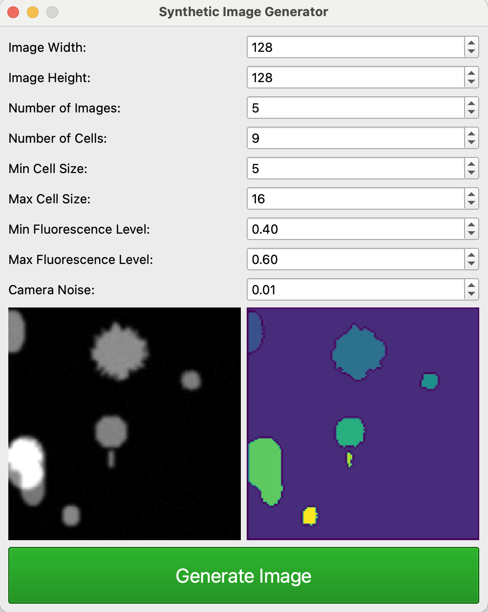
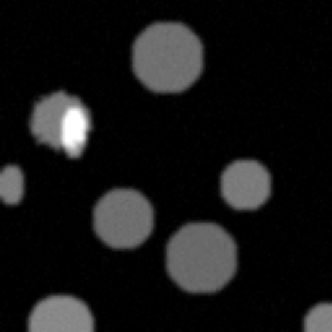

# Synthetic Image Generator
Synthetic Image Generator is a tool for creating synthetic fluorescence microscopy images of cells, along with their labeled counterparts. This generator is ideal for creating datasets for training machine learning models in segmentation tasks.

<p align="center">
  
  <br>
  <em>Example of a Generated Fluorescence Image (1024 x 1024)</em>
</p>

## 🚀 Features

- **Customizable Image Generation**: Configure image size, number of images, cell count, fluorescence levels, and camera noise level.
- **Realistic Fluorescence Images**: Generates high-quality images suitable for training segmentation models.
- **Labeled Outputs**: Provides corresponding labeled images with distinct cell identifiers.

## 📥 Installation

Clone the repository and install dependencies:

```bash
git clone https://github.com/vinaykadam007/synthetic-image-generator.git
cd synthetic-image-generator
conda create -n "env" python=3.11
pip install -r requirements.txt
python app.py
```

## 🛠️ Usage

To generate synthetic images, execute the app.py file:

<p align="center">
  
  <br>
  <em>Simple Graphical User Interface</em>
</p>


## 🔧 Input Parameters

- Image width: Width of the image in pixels.
- Image height: Height of the image in pixels.
- Num of cells: Number of cells to simulate.
- Min & Max fluorescence_level: Intensity of the fluorescence signal.
- Cell size: Specifying minimum and maximum cell sizes.
- Camera noise level: Amount of noise to add to the image for realism.
  
## 📤 Output Files

Fluorescence Image: A .png file of the generated yeast cells.
Labeled Image: A .png file with labeled cells, where the background is 0 and cells are labeled with incrementing integers.

## Examples

Generate a 128x128 pixel image with 9 cells:

<p align="center">
  
  
  <br>
  <em>Generated Fluorescence and Label Image</em>
</p>

    
## 📚 References
1. Unet and watershed algorithm - Python for Microscopists Github Repo (https://github.com/bnsreenu/python_for_microscopists)
2. PyQt Documentation (https://doc.qt.io/qtforpython-6/)
